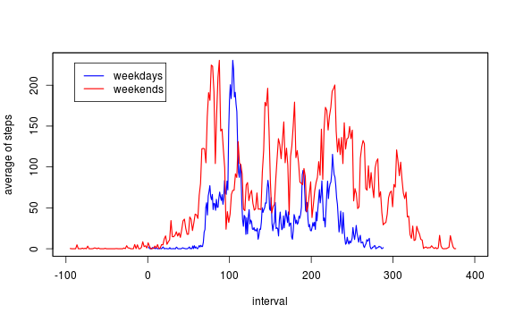
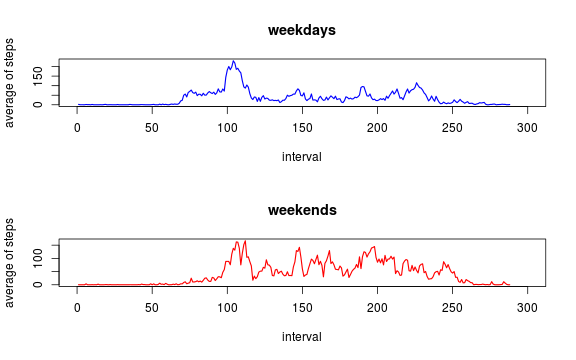

# PA1. Reproducible Research ( Coursera)
amaurandi@um.es  
9.Junio.2014  
----------------------------------------


# Loading and processing the data

Exploration of the data and data structure.  


```r
df <- read.table("activity.csv", sep = ",", header = T)
sdf <- summary(df)
xt <- xtable(sdf)

print(xt, type = "html")
```

<!-- html table generated in R 3.1.0 by xtable 1.7-3 package -->
<!-- Mon Jun  9 16:47:11 2014 -->
<TABLE border=1>
<TR> <TH>  </TH> <TH>     steps </TH> <TH>         date </TH> <TH>    interval </TH>  </TR>
  <TR> <TD align="right"> 1 </TD> <TD> Min.   :  0   </TD> <TD> 2012-10-01:  288   </TD> <TD> Min.   :   0   </TD> </TR>
  <TR> <TD align="right"> 2 </TD> <TD> 1st Qu.:  0   </TD> <TD> 2012-10-02:  288   </TD> <TD> 1st Qu.: 589   </TD> </TR>
  <TR> <TD align="right"> 3 </TD> <TD> Median :  0   </TD> <TD> 2012-10-03:  288   </TD> <TD> Median :1178   </TD> </TR>
  <TR> <TD align="right"> 4 </TD> <TD> Mean   : 37   </TD> <TD> 2012-10-04:  288   </TD> <TD> Mean   :1178   </TD> </TR>
  <TR> <TD align="right"> 5 </TD> <TD> 3rd Qu.: 12   </TD> <TD> 2012-10-05:  288   </TD> <TD> 3rd Qu.:1766   </TD> </TR>
  <TR> <TD align="right"> 6 </TD> <TD> Max.   :806   </TD> <TD> 2012-10-06:  288   </TD> <TD> Max.   :2355   </TD> </TR>
  <TR> <TD align="right"> 7 </TD> <TD> NA's   :2304   </TD> <TD> (Other)   :15840   </TD> <TD>  </TD> </TR>
   </TABLE>


He have arround 288 observations per day.

# What is mean total number of steps taken per day?


```r
# no account of misssign values
df1 <- na.omit(df)
su <- tapply(df1$steps, df1$date, sum)
su <- as.numeric(su)
```


Histogram of total number of steps per day


```r
hist(su, main = "Histogram of the total steps by day", breaks = 50, freq = T, 
    xlab = "steps")
```


The mean of the total step per day is **10766.189** and the median is **10765**.

# What is the average daily activity pattern?


```r
me <- tapply(df1$steps, df1$interval, mean)
plot(me, type = "l", xlab = "interval", ylab = "average of steps")
```


```r
maxinterval1 <- dimnames(me)[[1]][rev(order(me))[1]]
maxi1 <- max(me)
```


The 5 minute interavl that on average across all the days in the dataset  contains the maximum number of steps is the **835**, the maximun is 206.17.

# Imputing missing values


```r
nna <- as.numeric(sum(is.na(df$steps)))
```


The number of NA are: 2304


We will fill all of the missing values in the dataset with the mean for that 5<ad> minute interval. And create a new dataset with the missing data filled in.   


```r
df2 <- df  # with NAs
for (i in 1:nrow(df)) {
    # rellenamos con la media del intervalo, y creamos el dataf df2
    if (is.na(df$steps[i])) {
        MM <- mean(df$steps[which(df$interval == df$interval[i])], na.rm = T)
        if (!is.na(MM)) {
            df2$steps[i] <- MM
        } else {
            df2$steps[i] <- 99
        }
    }
}
# df2 is the new dataset with missing filled in
```


The number of missing data are 2304

```r
su2 <- tapply(df2$steps, df2$date, sum)
su2 <- as.numeric(su2)
```


Histogram of total number of steps per day of the dataset without missig data


```r
hist(su2, main = "Histogram of the total steps by day\n(no missig data)", breaks = 50, 
    freq = T, xlab = "steps")
```


After filling in the missing data with the mean of the interval, the mean of the total step per day is **10766.189** and the median is **10766.189**.   So we found very small diferences, oly the median change a bit.

# Are there differences in activity patterns between weekdays and weekends?


```r
# change factor to dates and set if they are weekdays or weekends
dd <- as.character(df2$date)
dd <- as.Date(dd, "%Y-%m-%d")
dow <- weekdays(dd, abbreviate = T)  # 'sáb', 'dom'--> Saturday and Sunday
# table(dow)
dow[dow == "sáb" | dow == "dom"] <- "weekend"
dow[dow != "weekend"] <- "weekday"
table(dow)
```

dow
weekday weekend 
  12960    4608 

```r
df2 <- data.frame(df2, dow = factor(dow))
```


```r
# xyplot(steps~interval | dow, df2, col="blue",type="l")
par(mfrow=c(1,1))
dfaux<-df2[df2$dow=="weekday",]
me<-tapply(dfaux$steps, dfaux$interval, mean)
plot(me,type="l"
     , xlab="interval"
     , ylab="average of steps"
     ,col="blue"
     , xlim=c(0, 300)
     ,lwd=1.5
     , asp=T)
dfaux<-df2[df2$dow=="weekend",]
me<-tapply(dfaux$steps, dfaux$interval, mean)
par(new=TRUE)
plot(me,
     type="l",
     col="red", 
     ylab="", xlab=""
     ,xaxt='n', yaxt='n'
     , xlim=c(0, 300)
     ,lwd=1.5)
legend("topleft", inset=.05
#        , title="jjjjj"
       ,c("weekdays","weekends")
       ,lty=c(1,1)
       ,lwd=c(1.5,1.5)
       ,col=c("blue","red")
       , horiz=F)
```




It seems that on weekend the activity (steps) are extend fom intervaal 100 till aproximately 250, on weekdays the maximun steps are arround 100. On the weekend there are more steps in later intervals than weekdays that theese steps are more concentrated arround the interval 100.  


```r

par(mfrow=c(2,1))
dfaux<-df2[df2$dow=="weekday",]
me<-tapply(dfaux$steps, dfaux$interval, mean)
plot(me,type="l"
     , xlab="interval"
     , ylab="average of steps"
     ,col="blue"
     ,lwd=1.5
     , xlim=c(0, 300)
#      , asp=T
     )
dfaux<-df2[df2$dow=="weekend",]
me<-tapply(dfaux$steps, dfaux$interval, mean)
# par(new=TRUE)
plot(me,
     type="l",
     col="red", 
     ylab="", xlab=""
     , xlim=c(0, 300)
#      ,xaxt='n', yaxt='n'
     ,lwd=1.5)
legend("topleft", inset=.05
#        , title="jjjjj"
       ,c("weekdays","weekends")
       ,lty=c(1,1)
       ,lwd=c(1.5,1.5)
       ,col=c("blue","red")
       , horiz=F)
```




```r
sessionInfo()
```

R version 3.1.0 beta (2014-03-28 r65330)
Platform: i686-pc-linux-gnu (32-bit)

locale:
 [1] LC_CTYPE=es_ES.UTF-8       LC_NUMERIC=C              
 [3] LC_TIME=es_ES.UTF-8        LC_COLLATE=es_ES.UTF-8    
 [5] LC_MONETARY=es_ES.UTF-8    LC_MESSAGES=es_ES.UTF-8   
 [7] LC_PAPER=es_ES.UTF-8       LC_NAME=C                 
 [9] LC_ADDRESS=C               LC_TELEPHONE=C            
[11] LC_MEASUREMENT=es_ES.UTF-8 LC_IDENTIFICATION=C       

attached base packages:
[1] stats     graphics  grDevices utils     datasets  methods   base     

other attached packages:
[1] lattice_0.20-27 xtable_1.7-3    knitr_1.5      

loaded via a namespace (and not attached):
[1] evaluate_0.5.3 formatR_0.10   grid_3.1.0     stringr_0.6.2 
[5] tools_3.1.0   


